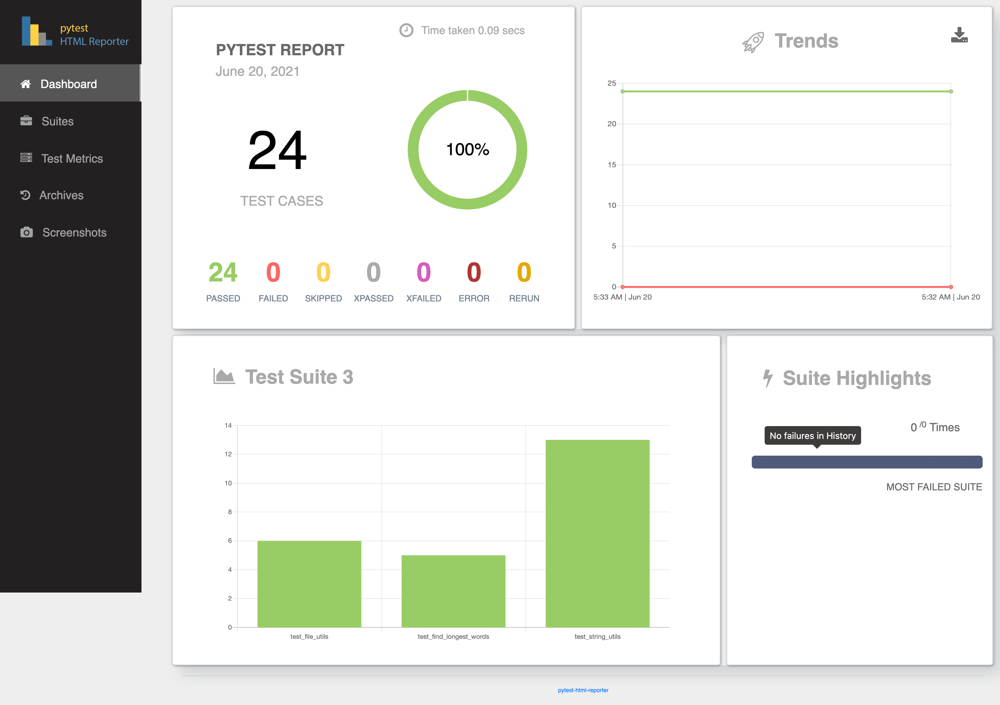

# sc_coding_challenge

## Use case
Given a file with set of words, find the longest word and transpose it.

## Assumptions
- When there are multiple longest words, return the first word
- If there are no words in the file, then printing "Couldn't find the longest word"
- Words with spaces before and after are trimmed to get the actual word
- Each line in a file can have multiple words with space as separator
- Any string which has a space or new line character before and after are considered words. 
- Special characters in words are counted as part of the word. 
    - Example: Full-stop (.) and apostrophie (’) are considered as part of words if present.

## Technology Stack
- Python3.5+
- Pytest
- pytest-html-reporter
- Docker (optional)

## Platforms
Tested on below operating systems
- Mac
- Windows

## Pre-requisites

*Note: If you have multiple versions(python2,python3+) of python installed, make sure that you use **python3 and pip3** at applicable places.*

Mac Users:
- Install [python3](https://docs.python-guide.org/starting/install3/osx/)
```cmd
brew install python 
pip install pytest
pip install pytest-html-reporter
```
Windows Users:
- Install [python3](https://www.python.org/downloads/)
```cmd
pip install pytest
pip install pytest-html-reporter    
```

## Execution Instructions

**Run the Application**
 - Navigate to the location of main.py (~/sc_coding_challenge/main.py) folder. 
 - file_location: Command line argument to pass the file path. It can be absolute or relative path. If this argument is not provided, file is defaulted to word_file.txt in the input_data_files folder.

```cmd
python main.py --file_location="tests/input_data_files/simple_file.txt"
```

**Run the test cases**
 - Navigate to the location of tests (~/sc_coding_challenge/tests) folder. 
 - Once the tests are run successfully, html report can be found at ~/sc_coding_challenge/tests/report/longest_transpose_word_testcases.html
```cmd
pytest -v --html-report=./report/longest_transpose_word_testcases.html
                            or
python -m pytest -v --html-report=./report/longest_transpose_word_testcases.html

```
 
**Using Docker** 
- Install the Docker Desktop
    - Mac Users: https://docs.docker.com/docker-for-mac/install/
    - Windows Users: https://docs.docker.com/docker-for-windows/install/ 
*Note:* Windows users shoud use powershell for docker commands execution
- Run the below command to execute the pytests. This will pull the image from docker hub and run the tests locally. Html report will be generated in the folder where the command is run from.
```cmd
docker rm longest_transposed_word_container
docker run --name longest_transposed_word_container --mount type=bind,source=$(pwd),target=/report santoshidevata/sc_coding_challenge_longest_transpose_word
```
- If you want to build the image and run locally, navigate to ~/sc_coding_challenge and run the below commands. Html report will be generated same folder as docker file.

```cmd
docker build -t sc_coding_challenge_longest_transpose_word . 
docker rm -f longest_transposed_word_container
docker run --name longest_transposed_word_container --mount type=bind,source=$(pwd),target=/report sc_coding_challenge_longest_transpose_word    
```

## Test Coverage
- Created 17 positive and 7 negative testcases

## Unit test Report
- Sample report can be found [here](https://github.com/nityasantoshi/sc_coding_challenge/blob/master/longest_transpose_word_testcases_docker.html)

